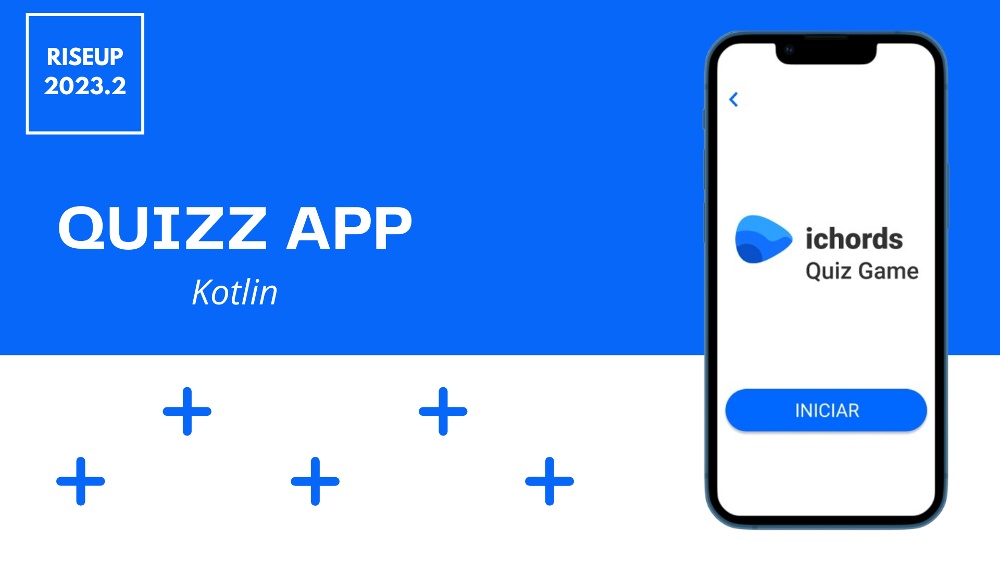

# Projeto ichords Quiz


## Sobre📘
### Objetivo
<p>O objetivo dessa versão do ichords é oferecer uma plataforma de aprendizado de música que abrange desde conceitos fundamentais até desafios mais avançados. O aplicativo é desenvolvido para entusiastas da música que desejam melhorar suas habilidades em violão e teoria musical. </p>

## Tecnologias Utilizadas🛠
- [Android Studio](https://developer.android.com/studio)
- [Kotlin](https://kotlinlang.org/)
- [RecyclerView](https://developer.android.com/guide/topics/ui/layout/recyclerview)
- [Intent](https://developer.android.com/reference/android/content/Intent)
- [Handler](https://developer.android.com/reference/android/os/Handler)
- [SharedPreferences](https://developer.android.com/training/data-storage/shared-preferences?hl=pt-br)

## Recursos Destacados🎮
1. <b>Quiz Interativo:</b> Teste seus conhecimentos musicais com o quiz incorporado.
2. <b>Biblioteca de Músicas:</b> Explore uma vasta biblioteca de músicas para que possam ser adicionadas a sua playlist temporária.
3. <b>Lojas Musicais:</b> Descubra e adquira produtos musicais na loja integrada.

## Tópicos Abordados no Projeto☑
<p> Esse aplicativo foi desenvolvido com base no ichords, contando somente com componentes ensinados durante o processo do projeto que abrange os seguintes desafios:</p>
<b>1. Lição:</b>
    <br>- Prática;<br>
    - Músicas Relacionadas com a lição.<br>
<br><b>2. Componentes:</b><br>
    - Orientação a objetos<br>
    - RecyclerView<br>
    - SharedPreferences<br>
    - Comunicação entre telas (Intent e Extras)<br>


## Funcionalidades realizadas pela equipe:
- <b>1. Construção da Interface do Usuário</b>
  - Desenvolvimento das telas iniciais, de login, perfil, favoritos e loja.
- <b>2. Quiz Interativo</b>
  - Implementação de um quiz interativo para testar conhecimentos musicais.
  - Apresentação de perguntas dinâmicas com feedback em tempo real. 
- <b>3. Biblioteca de Músicas</b>
  - Criação de uma biblioteca de músicas temporárias.
  - Possibilidade de filtrar acordes por nome. 
- <b>4. Loja Musical</b>
  - Desenvolvimento de uma loja virtual para explorar e adquirir produtos musicais.
- <b>5. Integração de Telas</b>
  - Conexão eficiente entre as diferentes telas do aplicativo.

## Estrutura do Projeto💀
<p> O projeto está organizado em diversas atividades e classes. Aqui estão alguns destaques: </p>

- <b>1. BibliotecaActivity</b>
  - Tela que exibe uma biblioteca de músicas temporárias. Implementa funcionalidades de pesquisa e navegação.
  - Apresentação de perguntas dinâmicas com feedback em tempo real. 
- <b>2. BibliotecaAdapter e BibliotecaData</b>
  - Adaptação e representação dos dados da biblioteca de música.
- <b>3. FavoritosActivity</b>
  - Tela para visualizar e gerenciar músicas favoritas.
- <b>4. HomeActivity</b>
  - Tela inicial do aplicativo com navegação intuitiva.
- <b>5. InitialSplash</b>
  - Tela de abertura inicial com transição para a tela principal.
- <b>6. MainActivity</b>
  - Lida com a autenticação e redirecionamento para a tela principal.
- <b>7. ProfileActivity</b>
  - Tela que exibe informações do perfil do usuário.
- <b>8. QuestionModel e QuizActivity</b>
  - Modelagem e implementação do quiz interativo.
- <b>9. ResultActivity</b>
  - Exibição dos resultados do quiz após a conclusão.
- <b>10. ShopActivity</b>
  - Tela que oferece uma experiência de compra para produtos musicais.
- <b>11. SplashActivity</b>
  - Tela de abertura com transição suave para a tela de quiz.
- <b>12. StartActivity</b>
  - Tela inicial que oferece a opção de iniciar o quiz.

## Guia de Instalação📄
<p>Siga estes passos para configurar e executar o aplicativo em seu ambiente de desenvolvimento:</p>

<b>Clone este repositório:</b>
```git clone https://github.com/JuanHenriq/ichords.git```

### **Passo 1: Clone do Projeto**

1. <b>Abra o projeto no Android Studio:</b>
    1. Abra o Android Studio.
    2. No menu principal, clique em "File" (Arquivo) e selecione "Open" (Abrir).
    3. Navegue até o diretório onde você clonou o repositório e selecione a pasta do projeto.
2. <b>Configure o Emulador ou Conecte um Dispositivo Android:</b>
    1. Selecione ou crie um emulador Android usando o AVD Manager no Android Studio.
    2. Conecte um dispositivo Android ao computador usando um cabo USB e ative a depuração USB nas configurações do desenvolvedor.
3. <b>Execute o Aplicativo:</b>
    1. No Android Studio, clique no botão "Run" (Executar) ou pressione Shift + F10 para compilar e executar o aplicativo.
    2. Selecione o emulador ou dispositivo Android desejado.
4. <b>Explore o Aplicativo:</b>
    1. Uma vez instalado, explore as funcionalidades do aplicativo no emulador ou dispositivo Android.


### **Passo 2: Geração do APK no Android Studio**

Certifique-se de que você gerou o arquivo APK do seu projeto no Android Studio.

1. **Build do Projeto**: No Android Studio, vá para o menu e clique em "Build" ou "Construir".

2. **Build Bundle(s) / APK(s)**: Selecione "Build Bundle(s) / APK(s)".

3. **Build APK(s)**: Escolha "Build APK(s)" para gerar o arquivo APK do seu aplicativo.

### **Passo 3: Transferência para o Smartphone**

Agora, precisamos transferir o arquivo APK para o seu smartphone.

1. **Conecte o Smartphone ao Computador**: Use um cabo USB para conectar o smartphone ao computador.

2. **Copie o APK para o Smartphone**: Copie o arquivo APK gerado para o armazenamento interno ou externo do seu smartphone.

### **Passo 4: Instalação do APK no Smartphone**

Agora, podemos instalar o aplicativo no smartphone.

1. **Abra o Gerenciador de Arquivos**: No smartphone, abra o aplicativo de gerenciamento de arquivos.

2. **Localize o APK**: Encontre o arquivo APK que você transferiu.

3. **Toque no APK**: Toque no arquivo APK para iniciar o processo de instalação.

4. **Permissões**: Se solicitado, conceda as permissões necessárias.

5. **Instalar**: Toque em "Instalar" para iniciar a instalação.

6. **Concluir a Instalação**: Após a conclusão, você verá uma mensagem indicando que o aplicativo foi instalado.

### **Passo 5: Execução do Aplicativo no Smartphone**

Finalmente, inicie o aplicativo em seu smartphone.

1. **Encontre o Ícone do Aplicativo**: No menu de aplicativos ou tela inicial, procure pelo ícone do seu aplicativo.

2. **Toque para Abrir**: Toque no ícone para iniciar o aplicativo.

Agora você deve ter com sucesso instalado e executado o seu aplicativo Android no seu smartphone. Lembre-se de que você pode precisar repetir o processo sempre que atualizar o aplicativo.

## Agradecimentos💙

<p> Todo o Squad 02 agradece pela oportunidade de percorrer este projeto. Através desse período foi possível aprimorar nossas habilidades de desenvolvimento mobile e o trabalho em equipe. </p>
